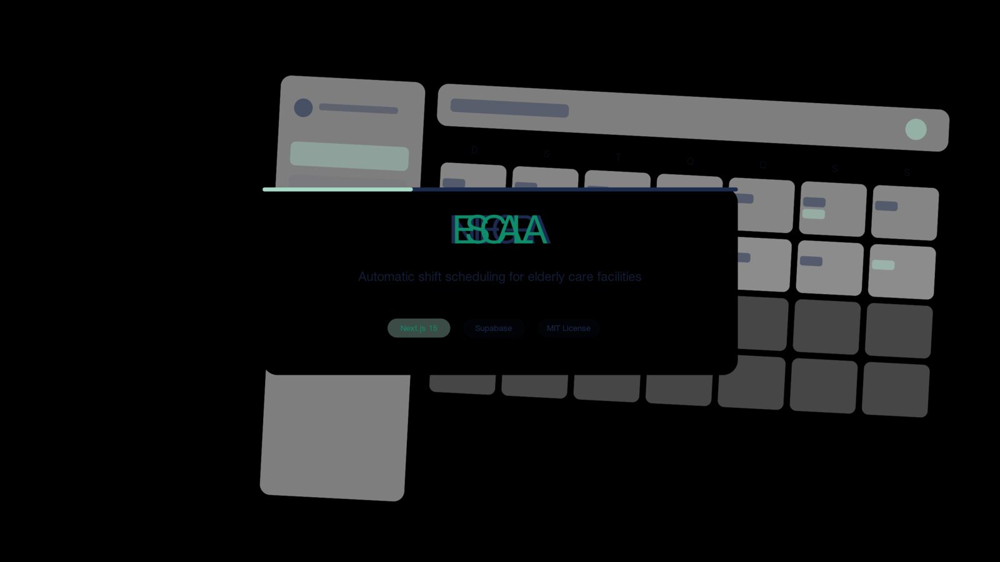

# Integra Escala

<p align="center">
  
</p>

<p align="center">
  <a href="README.md">🇺🇸 English</a> · <a href="#portugues">🇧🇷 Português (Brasil)</a>
</p>

<p align="center">
  <strong>Gerador automático de escalas de trabalho para ILPIs.</strong><br>
  Gere escalas mensais equilibradas e em conformidade com a legislação em segundos — não horas.
</p>

<p align="center">
  <a href="https://github.com/claudioorjunior/integra-escala/blob/main/LICENSE"></a>
  <a href="https://github.com/claudioorjunior/integra-escala/stargazers"></a>
  
  
  
  
</p>

---

<a name="portugues"></a>
## 🇧🇷 Português (Brasil)

**Integra Escala** é um aplicativo web open-source que automatiza a montagem de escalas mensais de trabalho para **ILPIs** (*Instituições de Longa Permanência para Idosos*).

Ele substitui planilhas propensas a erro e montagem manual de grade por um gerador rápido, com validação de regras, que respeita a legislação trabalhista brasileira aplicada ao setor: mínimo de 11h entre jornadas, teto de 44h semanais, DSR obrigatório, e cobertura por função.

### Por que este projeto existe

ILPIs precisam funcionar 24/7 com equipe limitada e orçamento apertado. Montar a escala mensal manualmente é uma das tarefas mais demoradas e suscetíveis a erro do gestor — e um único equívoco pode colocar a instituição em situação irregular. O Integra Escala transforma uma tarefa mensal de 4–6 horas em uma operação de um clique.

### Funcionalidades

- **Geração de escala mensal em um clique** com validação de regras
- **Ajustes por arrastar e soltar** quando a realidade foge do plano
- **Cobertura multi-função** (enfermeiros, técnicos, cuidadores, limpeza)
- **Controle de carga horária por colaborador** (horas, plantões, folgas)
- **Multi-tenant por padrão** — dados de cada ILPI isolados via Supabase RLS
- **Onboarding por convite** — gestores convidam cuidadores por e-mail
- **Landing page pública** com autenticação (login/cadastro)
- **Responsivo** — gestores podem ajustar pelo celular no plantão

### Stack técnica

| Camada | Escolha |
|---|---|
| Frontend | Next.js 15 (App Router) + React 19 |
| Estilização | Tailwind CSS v4 + shadcn/ui |
| Auth & DB | Supabase (Postgres + Auth + RLS) |
| Formulários | React Hook Form + Zod |
| Deploy | Pronto para Vercel |

### Início rápido

```bash
# 1. Clonar
git clone https://github.com/claudioorjunior/integra-escala.git
cd integra-escala

# 2. Instalar
pnpm install          # ou npm install / yarn

# 3. Configurar
cp .env.example .env.local
# preencha NEXT_PUBLIC_SUPABASE_URL e NEXT_PUBLIC_SUPABASE_ANON_KEY
# (crie um projeto gratuito em https://supabase.com)

# 4. Aplicar migrations
# Rode os arquivos .sql em /docs/migrations no seu projeto Supabase

# 5. Rodar
pnpm dev
# abra http://localhost:3000
```

### Estrutura do projeto

```
integra-escala/
├── src/
│   ├── app/                 # Next.js App Router (landing, login, dashboard, ...)
│   ├── components/          # Componentes UI (shadcn/ui + customizados)
│   └── lib/
│       ├── supabase/        # Cliente Supabase (browser/server/middleware)
│       └── scheduling/      # Motor de geração de escala
├── docs/
│   ├── migrations/          # Migrations SQL (aplicar no Supabase)
│   ├── prd.md               # Product Requirements Document
│   ├── security-review.md   # Modelo de ameaças + mitigações
│   ├── seo.md               # Guia de SEO/marketing
│   └── banner.png           # Imagem do cabeçalho do README
└── public/                  # Assets estáticos
```

### Roadmap

- [x] MVP: autenticação, dashboard, visão mensal, colaboradores
- [x] Sistema de convites
- [ ] Motor de geração automática de escala (em andamento)
- [ ] Exportação em PDF
- [ ] Notificações push
- [ ] Dashboards multi-instituição

### Como contribuir

PRs são bem-vindos! Este é um projeto focado — se você já trabalhou com operações em saúde ou construiu ferramentas de escala, sua contribuição vale ouro. Abra uma issue primeiro para discutirmos a abordagem.

### Licença

MIT — veja [LICENSE](LICENSE). Use, faça fork, venda serviços em torno.

### Mantenedor

Construído por [@claudioorjunior](https://github.com/claudioorjunior) como parte da família **Integra** de ferramentas open-source para ILPIs brasileiras.

---

<p align="center">
  <a href="README.md">🇺🇸 Read in English</a>
</p>
